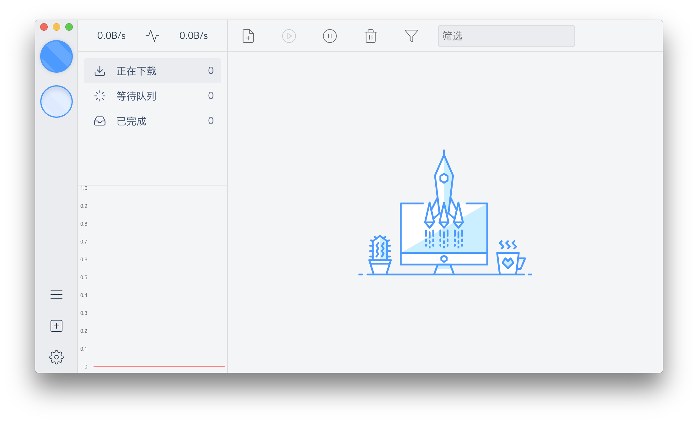
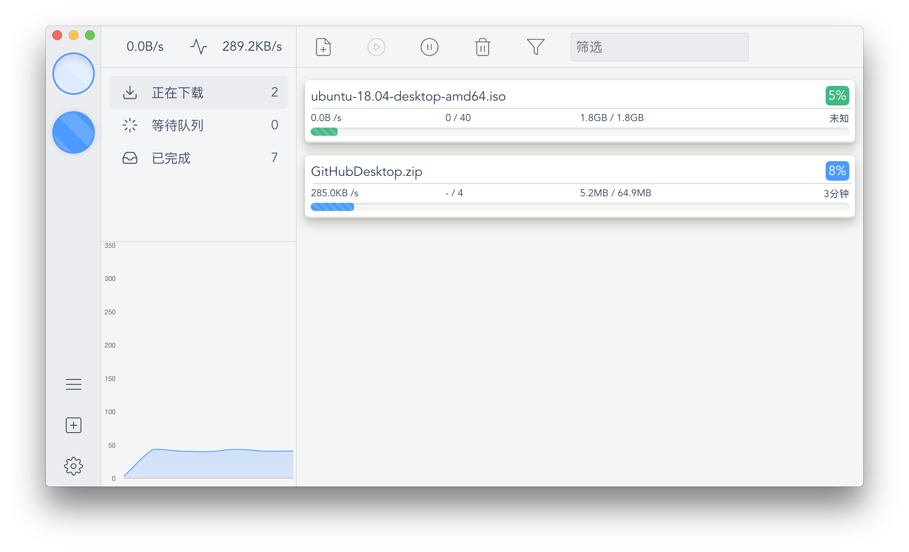

# stomp-box

> 一个使用electron-vue构建的aria2客户端。\
> An electron-vue project.



---

### 待办（todo）

- [ ] Windows版的下载功能Bug
- [ ] 检索功能
- [ ] 通知
- [ ] 速度折线图样式 
- [ ] 零星的Bug 
---

### 构建（Build Setup）

``` bash
# 安装依赖
npm install

# 开发模式运行
npm run dev

# 构建安装包
npm run build


# lint all JS/Vue component files in `src/`
npm run lint

```

---

This project was generated with [electron-vue](https://github.com/SimulatedGREG/electron-vue)@[7c4e3e9](https://github.com/SimulatedGREG/electron-vue/tree/7c4e3e90a772bd4c27d2dd4790f61f09bae0fcef) using [vue-cli](https://github.com/vuejs/vue-cli). Documentation about the original structure can be found [here](https://simulatedgreg.gitbooks.io/electron-vue/content/index.html).
