# stomp-box

> 一个使用 electron-vue 构建的 aria2 客户端。\
> An electron-vue project.

---


```
2018年后未再更新 stomp-box 项目已归档
```

---

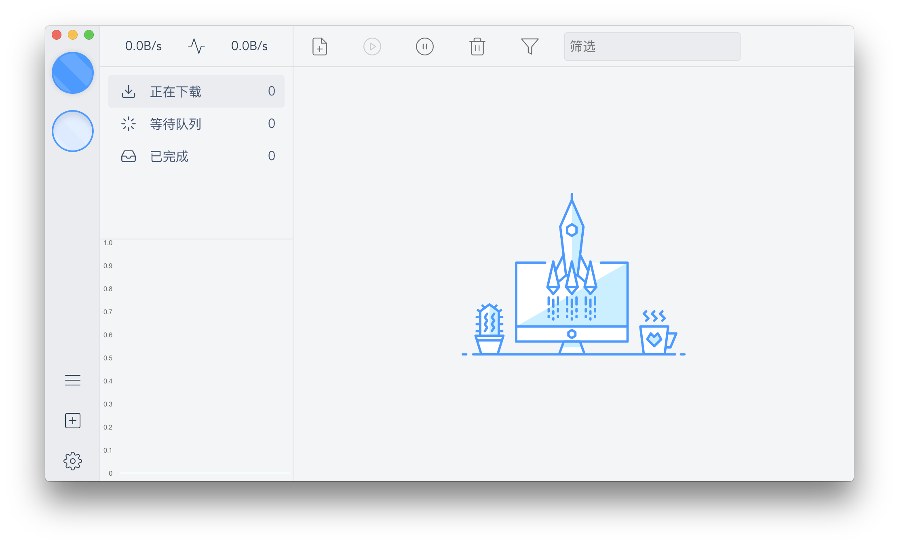
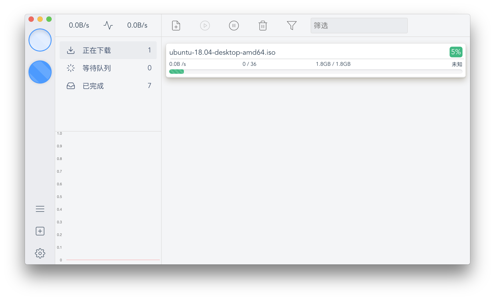
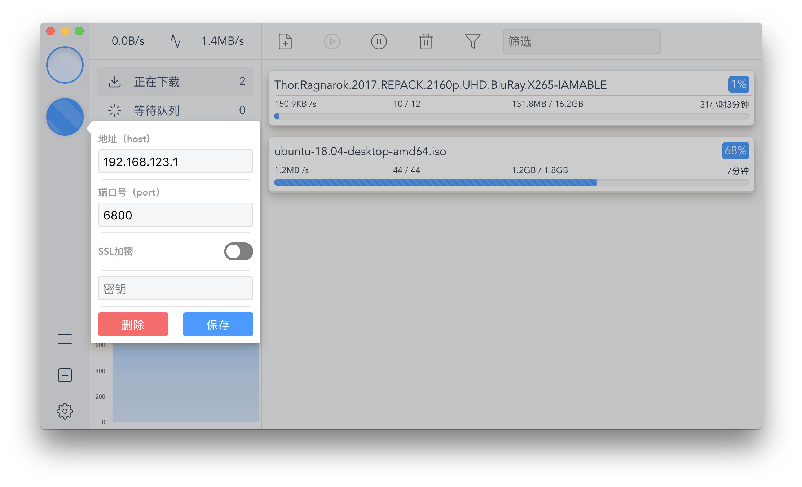
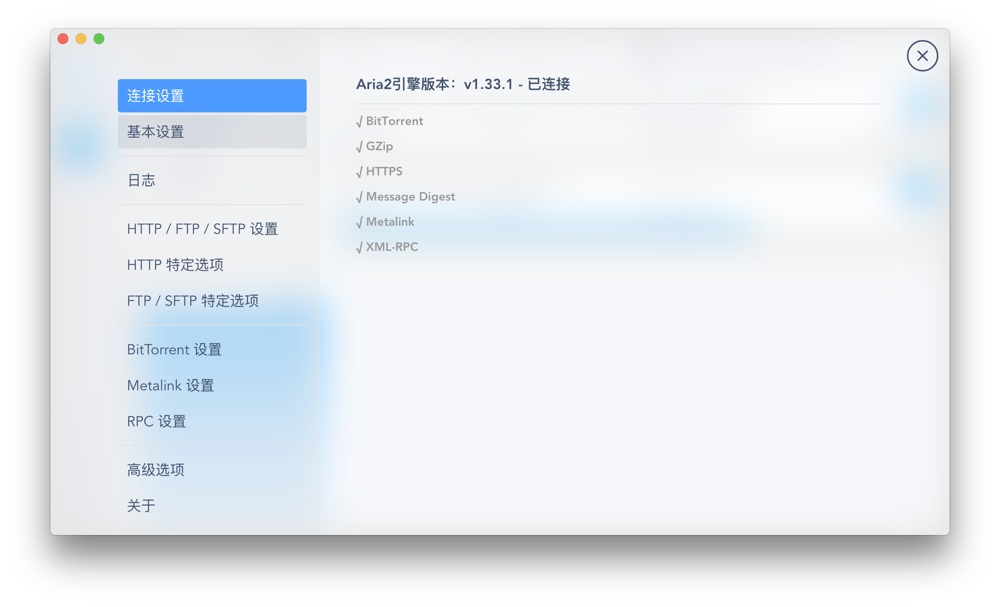

---

<details>
  <summary>more pics(10+)</summary>

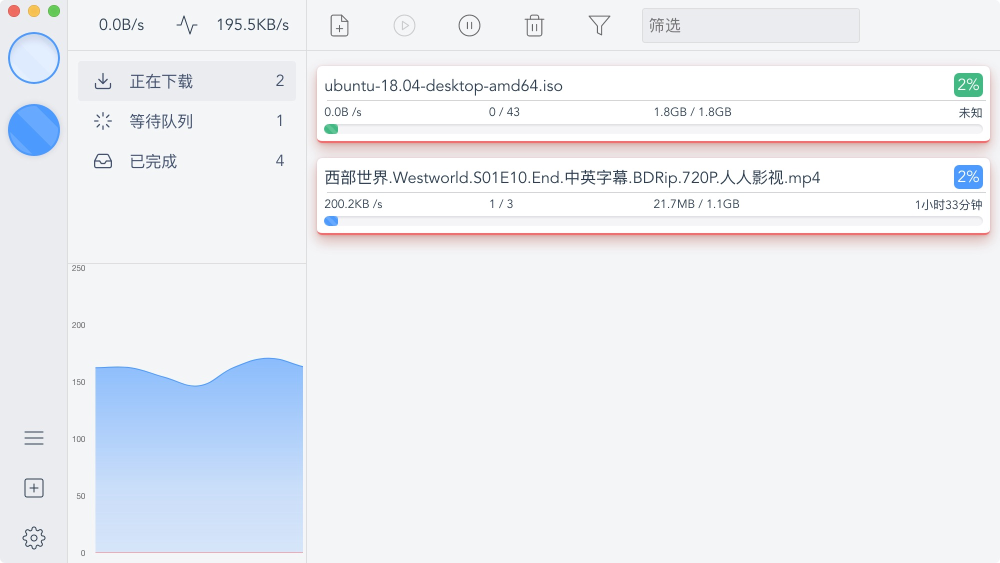
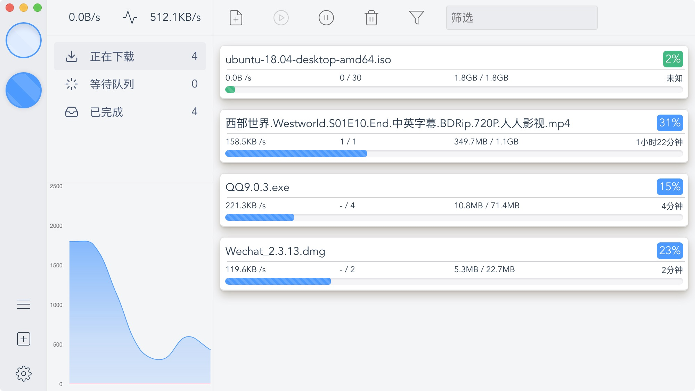
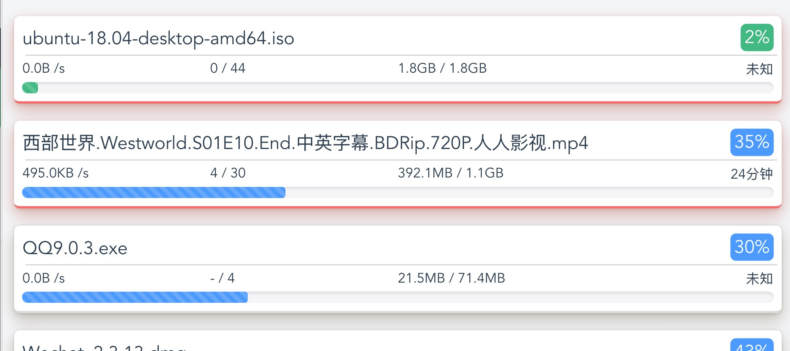
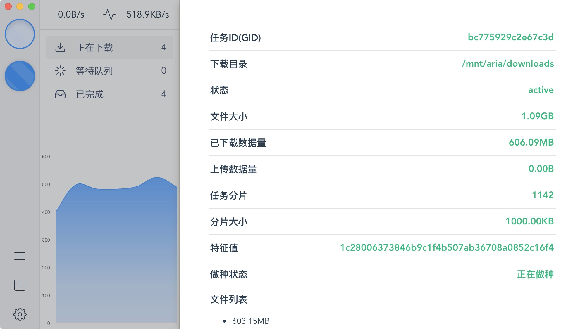
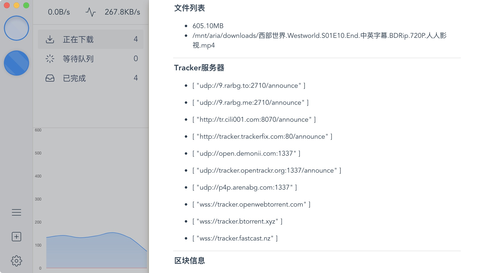
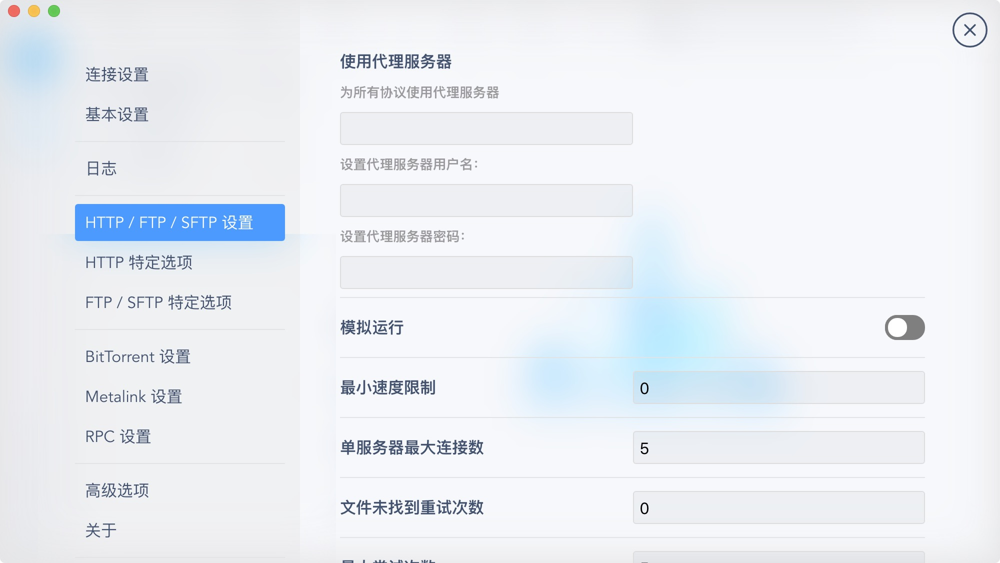
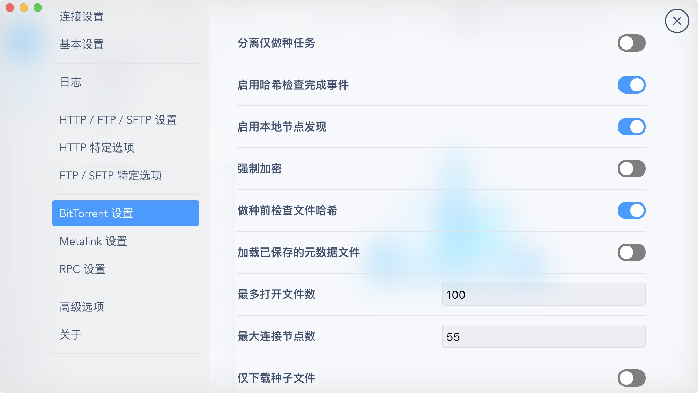
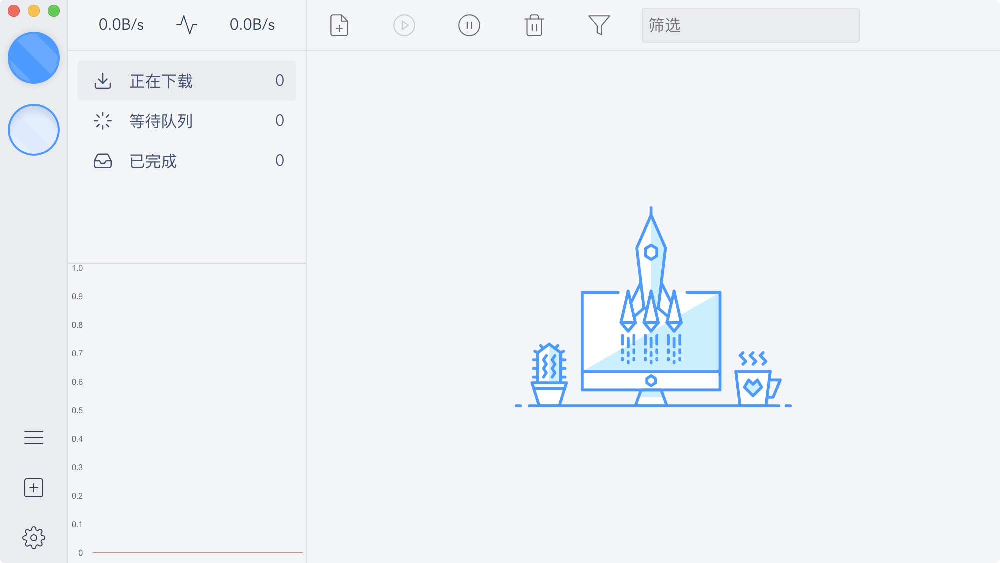
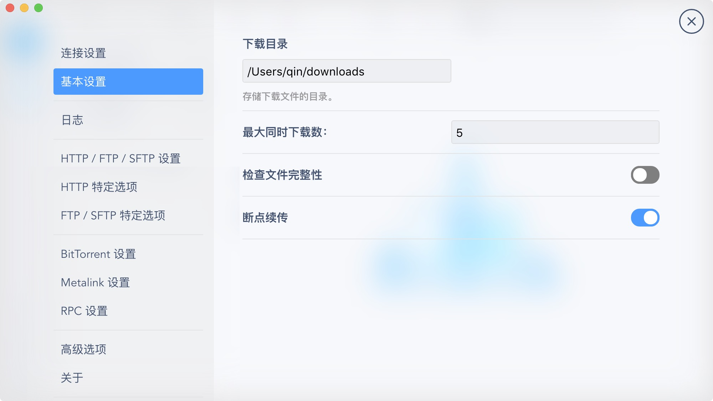
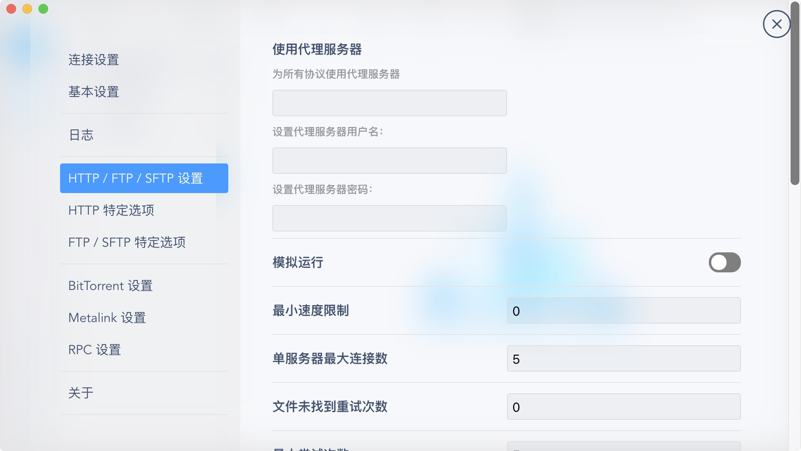
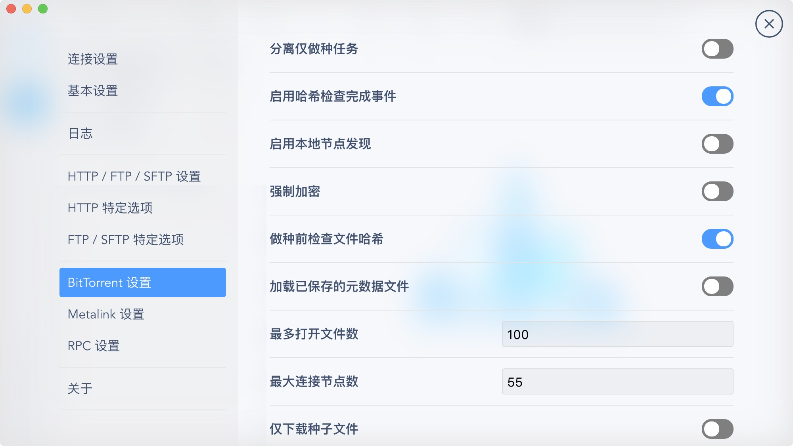
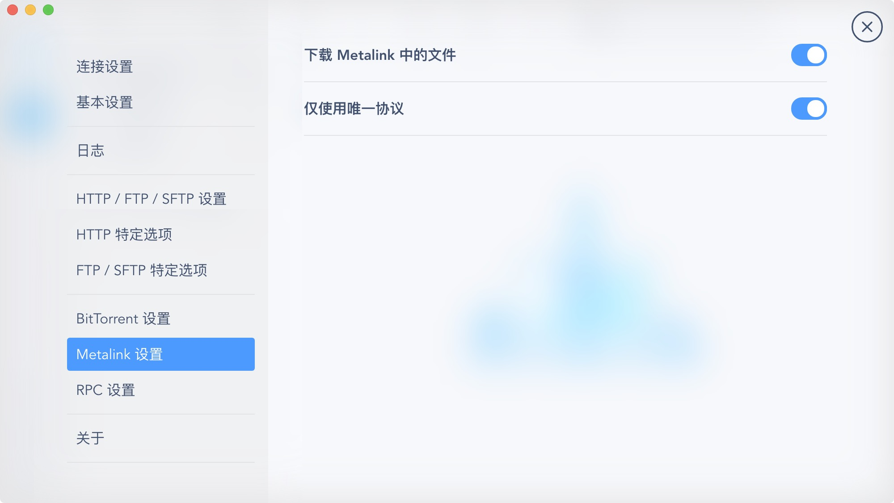
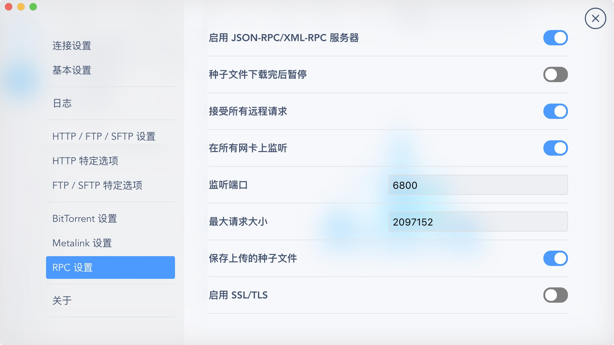
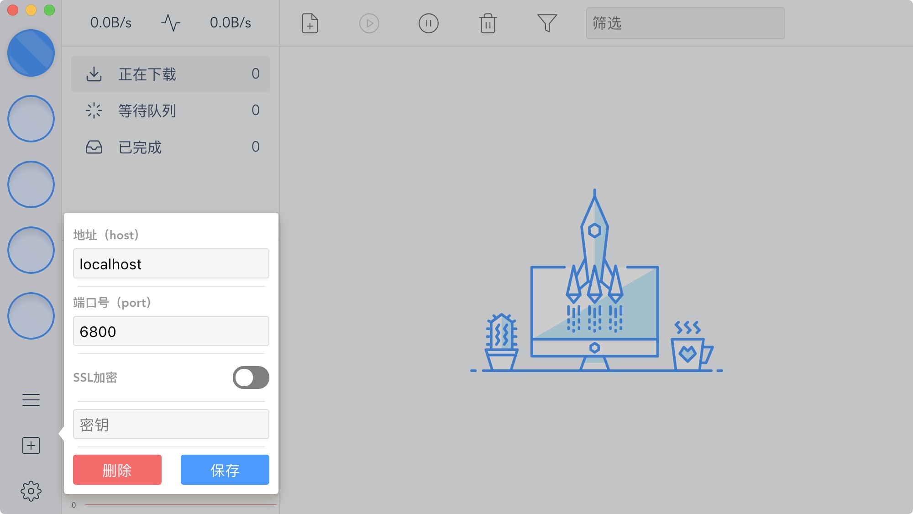

</details>

---

### ~~待办（todo）~~

- [ ] Windows 版的下载功能 Bug
- [ ] 检索功能
- [ ] 通知
- [ ] 速度折线图样式
- [ ] ~~零星~~海量的 Bug

---

### 构建（Build Setup）

```bash
# 安装依赖
npm install

# 开发模式运行
npm run dev

# 构建安装包
npm run build


# lint all JS/Vue component files in `src/`
npm run lint

```

---

This project was generated with [electron-vue](https://github.com/SimulatedGREG/electron-vue)@[7c4e3e9](https://github.com/SimulatedGREG/electron-vue/tree/7c4e3e90a772bd4c27d2dd4790f61f09bae0fcef) using [vue-cli](https://github.com/vuejs/vue-cli). Documentation about the original structure can be found [here](https://simulatedgreg.gitbooks.io/electron-vue/content/index.html).
